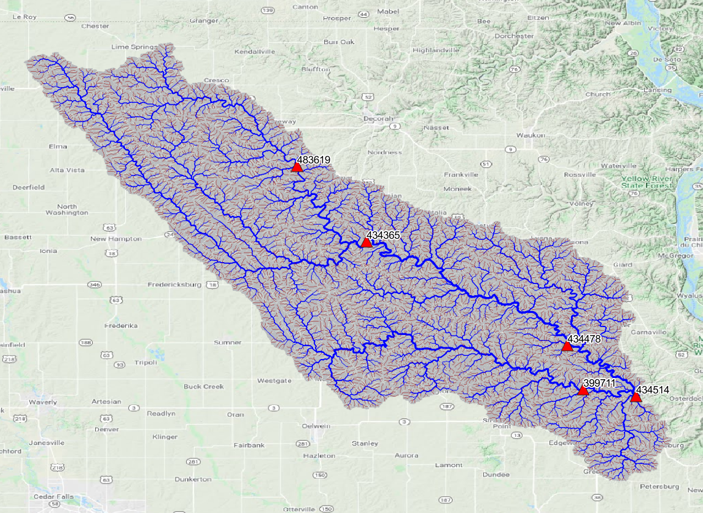

<!--
*** Thanks for checking out this README Template. If you have a suggestion that would
*** make this better, please fork the repo and create a pull request or simply open
*** an issue with the tag "enhancement".
*** Thanks again! Now go create something AMAZING! :D
***
***
***
*** To avoid retyping too much info. Do a search and replace for the following:
*** github_username, repo_name, twitter_handle, email
-->


<!-- PROJECT SHIELDS -->
<!--
*** I'm using markdown "reference style" links for readability.
*** Reference links are enclosed in brackets [ ] instead of parentheses ( ).
*** See the bottom of this document for the declaration of the reference variables
*** for contributors-url, forks-url, etc. This is an optional, concise syntax you may use.
*** https://www.markdownguide.org/basic-syntax/#reference-style-links
-->
[![Contributors][contributors-shield]][contributors-url]
[![Forks][forks-shield]][forks-url]
[![Stargazers][stars-shield]][stars-url]
[![Issues][issues-shield]][issues-url]
[![MIT License][license-shield]][license-url]


<!-- PROJECT LOGO -->
<br />
<p align="center">

  <h3 align="center">Towards Decoding the Ability of AI Algorithms to Identify the Input-Output Function Connecting Rainfall and Streamflow</h3>
<br />
  <p align="center">
    <br />
     <a href="https://github.com/Avi1122/Floood_Prediction_Project">
    
      </a>
    <a href="https://github.com/Avi1122/Floood_Prediction_Project"><strong>Explore the docs »</strong></a>
    <br />
    <br />
    <a href="https://github.com/Avi1122/Floood_Prediction_Project/issues">Report Bug</a>
    ·
    <a href="https://github.com/Avi1122/Floood_Prediction_Project/issues">Request Feature</a>
  </p>
</p>


<!-- TABLE OF CONTENTS -->
## Table of Contents

* [About the Project](#about-the-project)
  * [Built With](#built-with)
* [Getting Started](#getting-started)
  * [Prerequisites](#prerequisites)
  * [Installation](#installation)
* [Usage](#usage)
* [Roadmap](#roadmap)
* [Contributing](#contributing)
* [License](#license)
* [Contact](#contact)
* [Acknowledgements](#acknowledgements)


<!-- ABOUT THE PROJECT -->
## About The Project

[![Attention Based GRU Encoder Decoder for Flood Prediction][product-screenshot]](https://example.com)

The aim of this research is to develop a neural-network-based predictive model for flood forecasts. The specific aims include: 
    <ol>
<li>Designing proper recurrent neural network architectures with the state-of-art techniques in the AI and ML community;</li>
<li>Comparing the developed models with the existing work in literature for flood forecast;</li>
<li>Studying the effects of partially selected input features on flood forecast for scalability reduction.</li>
</ol>

As illustrated in the above picture, We use Attention Based GRU Encoder Decoder networks for predicting streamflow forecast at a particlular sub-basin using the fucture and past knowledge of upstream sub-basin properties.

### Built With
The major frameworks that we used to built our project are:
* [Python](https://www.python.org/downloads/release/python-380/)
* [Tensorflow](https://www.tensorflow.org/api_docs)
* [Keras](https://keras.io)


<!-- GETTING STARTED -->
## Getting Started

To get a local copy up and running follow these steps.

### Prerequisites
<p>
Our work environment includes: <br />
cuda 11.4 <br />
gcc  9.4.0 <br />
cudnn_version 8 <br />
Nvidia driver 510.47.03 <br />
2 x Quadro RTX 8000 GPU machines <br />
anaconda3/2021.05 <br />

However, feel free to try different combinations using this [this](https://www.tensorflow.org/install/source#tested_build_configurations) guide which hints the tensorflow conpatibility. Assuming that you have a working combination of the prerequisites, 
<br />
</p>
1.We suggest you to start with a new conda environment. Say, 

```sh
conda create --name flood_prediction python=3.8
```
2.Activate the environment using

```sh
conda activate flood_prediction
```

### Installation

1. Clone the repo
```sh
git clone https://github.com/Avi1122/Floood_Prediction_Project.git
```
2. Install dependency packages using the *requirements.txt* file attached in this repo using
```sh
pip install -r requirements.txt
```

<!-- USAGE -->
## Usage

We created a sample dataset *masterdf2.csv* and 2 scipts.
<ul>
<li><em>runoff.sh</em> used for training a model which would be stored in a folder algin with intermidiary outputs. </li>
<li><em>runoff_pred.sh</em> uses the stored model to predict the streamflow at the given sub-basin for a test set</li>
</ul>

Make sure that the shell scripts in the repo have necessary permisions to execute.
```sh
chmod +x runoff.sh
```

and <br />
```sh
chmod +x runoff_pred.sh
```

To train the model use the following script.<br />
```sh
./runoff.sh
```

To predict outcome for sample inputs, use the following script.<br />
```sh
./runoff_pred.sh
```
However, If you need help in changing the arguments of the python file, the help section for both the python files is as follows.<br />
```sh
python Final_api.py -h
```
or <br />
```sh
python Predict_api.py -h
```


<!-- ROADMAP -->
## Roadmap

See the [open issues](https://github.com/Avi1122/Floood_Prediction_Project/issues) for a list of proposed features (and known issues).


<!-- CONTRIBUTING -->
## Contributing

Contributions are what make the open source community such an amazing place to be learn, inspire, and create. Any contributions you make are **greatly appreciated**.

1. Fork the Project
2. Create your Feature Branch (`git checkout -b feature/AmazingFeature`)
3. Commit your Changes (`git commit -m 'Add some AmazingFeature'`)
4. Push to the Branch (`git push origin feature/AmazingFeature`)
5. Open a Pull Request


<!-- LICENSE -->
## License

Distributed under the MIT License. See `LICENSE` for more information.


<!-- CONTACT -->
## Contact

Mudireddy Avinash Reddy - [@linkedin](https://www.linkedin.com/in/mudireddy-avinash-reddy-367121a2/) 

Project Link: [https://github.com/Avi1122/Floood_Prediction_Project](https://github.com/Avi1122/Floood_Prediction_Project)


<!-- ACKNOWLEDGEMENTS -->
## Acknowledgements

* [IIAI](https://www.iiai.uiowa.edu/)
* []()
* []()


<!-- MARKDOWN LINKS & IMAGES -->
<!-- https://www.markdownguide.org/basic-syntax/#reference-style-links -->
[contributors-shield]: https://img.shields.io/github/contributors/github_username/repo.svg?style=flat-square
[contributors-url]: https://github.com/Avi1122/Floood_Prediction_Project/graphs/contributors
[forks-shield]: https://img.shields.io/github/forks/github_username/repo.svg?style=flat-square
[forks-url]: https://github.com/Avi1122/Floood_Prediction_Project/network/members
[stars-shield]: https://img.shields.io/github/stars/github_username/repo.svg?style=flat-square
[stars-url]: https://github.com/Avi1122/Floood_Prediction_Project/stargazers
[issues-shield]: https://img.shields.io/github/issues/github_username/repo.svg?style=flat-square
[issues-url]: https://github.com/Avi1122/Floood_Prediction_Project/issues
[license-shield]: https://img.shields.io/github/license/github_username/repo.svg?style=flat-square
[license-url]: https://github.com/Avi1122/Floood_Prediction_Project/blob/master/LICENSE.txt
[product-screenshot]: images/Diag2.jpg
